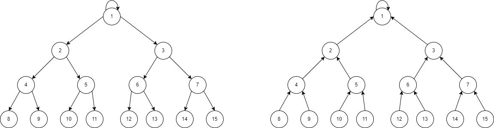
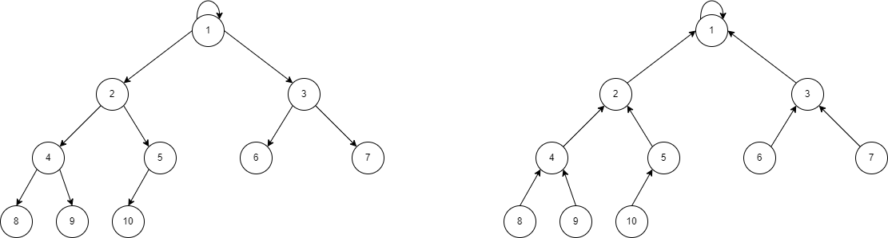

# B-ary Tree Push-Pull Method is Provably Efficient for Distributed Learning on Heterogeneous Data

We propose a highly efficient algorithm, termed ``B-ary Tree Push-Pull'' (BTPP), that employs two B-ary spanning trees for distributing the information related to the parameters and stochastic gradients across the network. The simple method is efficient in communication since each agent interacts with at most $(B+1)$ neighbors per iteration. More importantly, BTPP achieves linear speedup for smooth nonconvex objective functions with only $\tilde{O}(n)$ transient iterations, significantly outperforming the state-of-the-art results to the best of our knowledge.

<!-- This repository is the official implementation of [My Paper Title](https://arxiv.org/abs/2030.12345).  -->

## Requirements

To install requirements:

```setup
conda env create --file conda_env.yaml
conda activate pytorch_btpp
```

>📋 Our environment mainly bases on the pytorch and other relative packages. The datasets are MNIST and CIFAR10, which are downloaded from the official website.

##  Visualization

We provide the graphs that visualize the B-ary trees as follows:



*Remarks: Two spanning trees with $15$ nodes when $B=2$. On the left is $\mathcal{G}_{\mathcal{R}}$, and the right one is $\mathcal{G}_{\mathcal{C}}$.*



*Remarks: Two spanning trees with $10$ nodes when $B=2$. On the left is $\mathcal{G}_{\mathcal{R}}$, and the right one is $\mathcal{G}_{\mathcal{C}}$.*

>📋 The root node is labeled as $1$ for convenience, and we index the nodes layer-by-layer. The additional nodes are placed at the last layer if the tree is not full.

## Test BTPP on Synthetic Data

We test the performance of BTPP and other algorithms in `LogisticRegression/LogisticRegressionNCS.ipynb` to validate

1. comparison with other commonly-used distributed algorithms for non-convex problems;
2. comparison with different branch-size $B$.

<!-- ## Implementation of BTPP and the Comparison Between other Methods -->
## Train a Model with BTPP

We provide the implementation of the BTPP algorithm and show the comparison between it and other novel distributed algorithms, especially the $\Theta(1)$ per-iteration communication algorithms as listed in the paper.

You can run the BTPP where $B=2$ over 24 workers by the following command.
```
python pushpull.py --topo pp -na 24 -b 8 -lr 0.01 -ms 8000 11000 --model cnn --datasets mnist --iterations 13000 --record 300 --keep 3 -ht --warm_up 6000
```
where he starting model is enhanced by pre-training using the SGD optimizer on the entire MNIST dataset for several iterations through `--warm_up` and we consider a heterogeneous data setting, where data samples are sorted based on their labels and partitioned among the workers achieved by `-ht`.

To reproduce the experimental results in our paper, we provide the bash script.
```{bash}
bash mnist.sh
```

To plot the learning curves, we provide the MATLAB script in `record/loss_ht_mnist.m` etc. 
